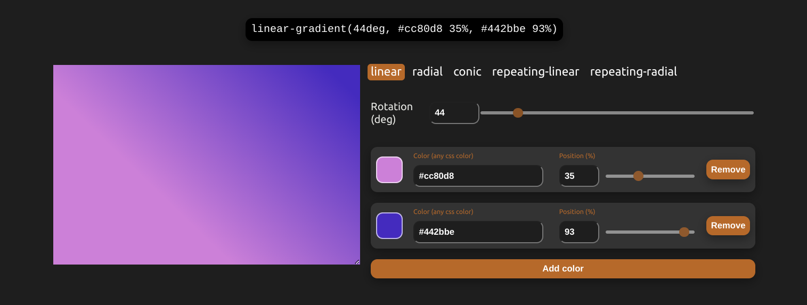
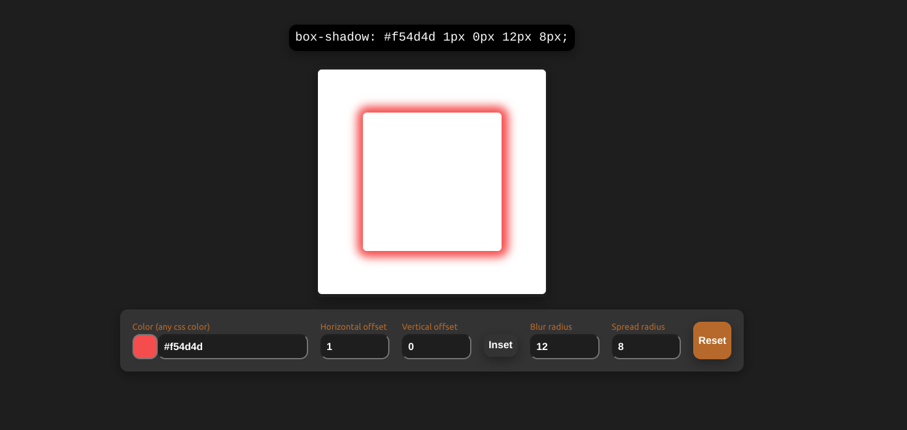

# [Cssesser](https://cssesser.web.app/)

Graphical tools for generating CSS.

## Grader

Tool for creating gradients. Supports linear, radial, conic, repeating-linear, and repeating-radial.

_Will generate random linear gradients if idle._

## Shader

Tool for creating box shadows.

_Will generate random box shadows if idle._

## Converter

Converts between color formats.

| Supported Formats |
| ----------------- |
| Name              |
| RGB               |
| RGBa              |
| Hex               |
| HSL               |
| HWB               |
| CMYK              |
| NCol              |
